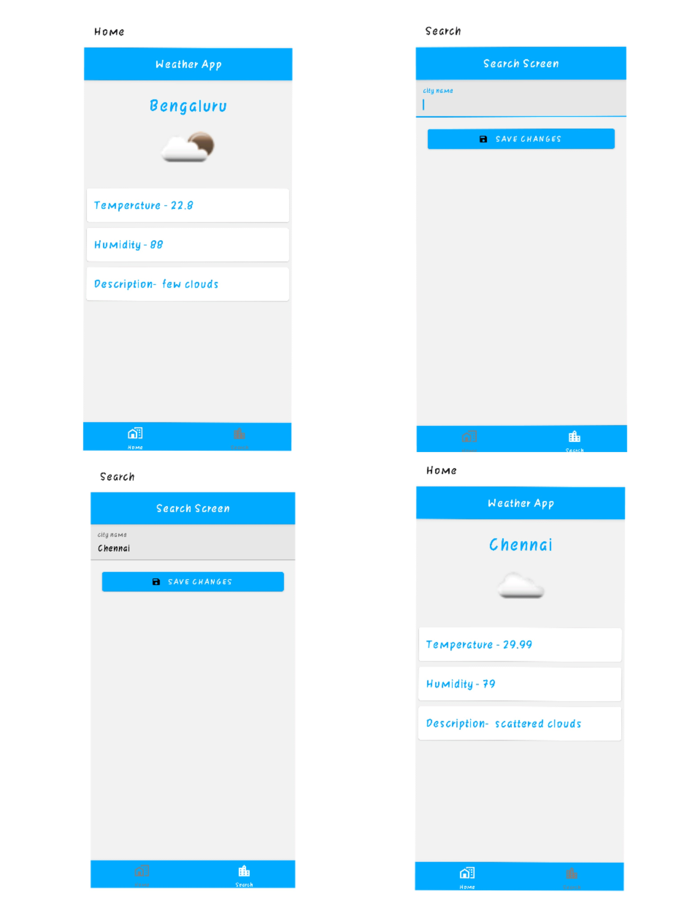

# Weather-React-Native-App
 A current weather forecasting android app using bare React Native Cli. 
 ● Application stack: React Native, Weather API - OpenWeatherMap . 
 ● Features: Display weather details like temperature, humidity, description, Check weather by city name
 
 # screens
 
 
 
 # Setting up the development environment
 
 Click on the link and follow the React Native CLI Quickstart
 https://reactnative.dev/docs/environment-setup
 
 
